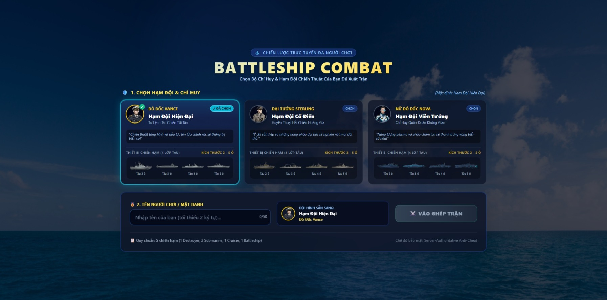
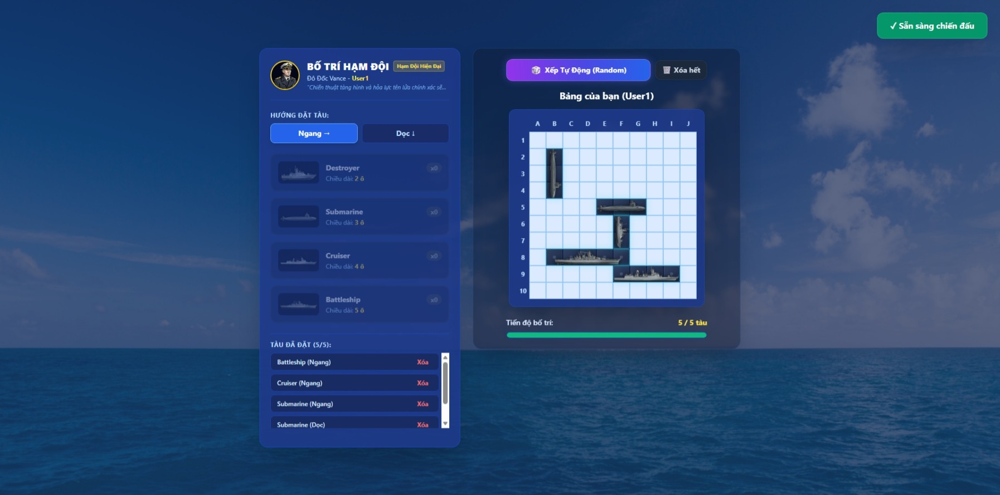
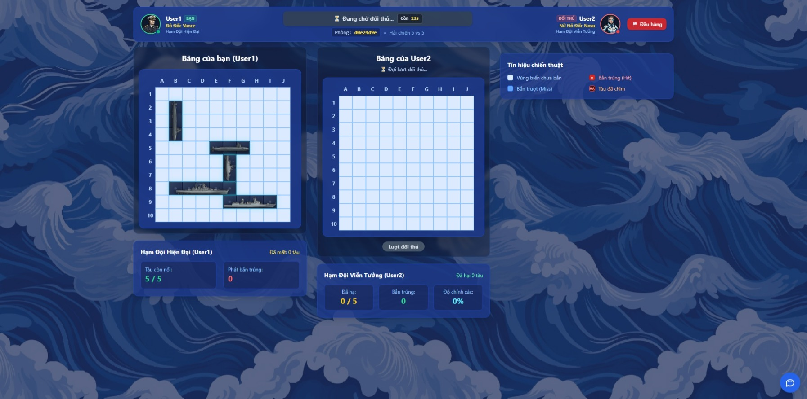
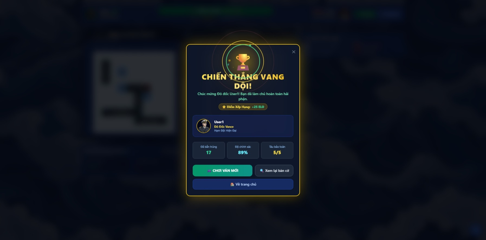

<a id="top"></a>
<div align="center">
  

  # 🚢 BATTLESHIP GAME - MULTIPLAYER WEBSOCKET

  > Trò chơi Bắn Thuyền Trực Tuyến Thời Gian Thực với 3 Bộ Hạm Đội & Chỉ Huy, Bảo Mật Server-Authoritative, Tích hợp Cơ Sở Dữ Liệu PostgreSQL & Bảng Xếp Hạng Elo.
</div>

---

## 🌟 TÍNH NĂNG NỔI BẬT

1. **3 Bộ Hạm Đội & 3 Chỉ Huy Trưởng Đồng Bộ**:
   - **Hạm Đội Hiện Đại (Modern Fleet)**: Chỉ huy Vance • Chiến hạm tàng hình Aegis, tàu ngầm hạt nhân, tuần dương tên lửa, thiết giáp hạm hiện đại.
   - **Hạm Đội Cổ Điển (Vintage Ironclad Fleet)**: Đại tướng Sterling • Dàn thiết giáp hạm bọc thép Thế chiến II với tháp pháo đại bác uy lực.
   - **Hạm Đội Viễn Tưởng (Sci-Fi Cyber Fleet)**: Nữ Đô đốc Nova • Hạm đội công nghệ lượng tử, năng lượng plasma và pháo ion tím neon.
   - Toàn bộ tàu (từ size 2 đến 5) và chân dung chỉ huy được tách nền trong suốt tuyệt đối (`alpha = 0` ở biên ngoài, `alpha = 255` sắc nét ở chi tiết bên trong).

2. **Sảnh Chờ Chọn Hạm Đội Trực Quan (`Login.tsx`)**:
   - Giao diện 3 thẻ bài hạm đội với chân dung Chỉ huy, tước hiệu, châm ngôn chiến đấu và mô hình 4 lớp tàu thu nhỏ.
   - Tự động fallback về Hạm Đội Hiện Đại nếu người chơi không thao tác chọn.

3. **Hiển Thị Con Thuyền Khi Bị Bắn Hạ (Sunk Ship Reveal)**:
   - Khi một con tàu bị bắn hạ hoàn toàn, mô hình con thuyền tương ứng với **chính bộ hạm đội mà đối thủ đã chọn** sẽ xuất hiện phủ kín các ô đã chìm kèm hiệu ứng hư hỏng/cháy nổ và huy hiệu `HẠ`.

4. **Bảo Mật Server-Authoritative Chống Gian Lận (Anti-Cheat)**:
   - Server tuyệt đối **không gửi** tọa độ tàu của đối thủ về máy client trước khi tàu đó bị bắn hạ 100%. Mở F12 / DevTools / Network Tab cũng không thể soi thấy vị trí tàu của đối phương.
   - Vô hiệu hóa phím tắt DevTools (F12, Ctrl+Shift+I/J/C, Ctrl+U), chặn click chuột phải và dọn sạch log WebSocket nhạy cảm trên Console.

5. **Khắc Phục Lỗi Giao Diện & Stacking Context**:
   - Loại bỏ triệt để hiện tượng các ô cờ bị kéo lê (drag selection) hoặc layer đè chồng chéo lên nhau khi hover/hold chuột nhanh trên bàn cờ.

6. **Tích Hợp Cơ Sở Dữ Liệu PostgreSQL & Bảng Xếp Hạng Elo**:
   - **Bảng `users`**: Quản lý hồ sơ người chơi, Hạm đội yêu thích, điểm Rank Elo (mặc định 1000), số trận thắng/thua và tỷ lệ thắng.
   - **Bảng `games`**: Lưu lịch sử từng ván đấu kèm diễn biến bàn cờ qua cột `details JSONB`.
   - **Zero-Lag Gameplay**: Quá trình bắn thuyền diễn ra 100% trên RAM (In-Memory). Việc ghi nhận kết quả và tính điểm Elo (`+25 / -20`) được thực hiện ngầm bất đồng bộ qua `asyncpg`.
   - **Graceful Fallback**: Nếu server chạy mà chưa bật PostgreSQL, hệ thống tự động chuyển sang lưu file `game_history.json` dự phòng mà không bao giờ bị dừng hay crash.
   - **Bảo Mật Biến Môi Trường (`.env`)**: Toàn bộ credential được bảo vệ an toàn trong `backend/.env`, không hardcode trong mã nguồn.

---

## 📸 HÌNH ẢNH MINH HỌA TRẢI NGHIỆM GAME (SCREENSHOTS)

Dưới đây là một số hình ảnh thực tế ghi nhận từ quá trình trải nghiệm game:

### 1. Sảnh Chờ & Bộ Chọn 3 Hạm Đội / Chỉ Huy
> Người chơi có thể tự do lựa chọn 1 trong 3 Hạm Đội độc bản (**Hiện Đại**, **Cổ Điển**, **Viễn Tưởng**) cùng chân dung Đô đốc, tước hiệu, châm ngôn và bộ chiến hạm tương ứng:



---

### 2. Giao Diện Bố Trí Hạm Đội & Xếp Tàu Tự Động
> Hiển thị trực quan toàn bộ chiến hạm khi được xếp vào bàn cờ với skin hạm đội đã chọn; đi kèm tính năng **`🎲 Xếp Tự Động (Random)`** dàn trận tức thì và **`🗑️ Xóa hết`**:



---

### 3. Trận Đấu Hải Chiến Đối Kháng Thời Gian Thực
> Thanh HUD đối đầu kịch tính giữa 2 Chỉ huy, hệ thống bàn cờ chống gian lận (Anti-Cheat) và hiệu ứng animation tàu bị bắn hạ chìm xuống biển có phân biệt rõ ràng giữa tàu địch và tàu ta:



---

### 4. Bảng Kết Quả Trận Đấu, Hiệu Ứng Pháo Hoa & Nút Về Trang Chủ
> Màn hình công bố kết quả với hiệu ứng **Pháo hoa 360°** rực rỡ quanh Cúp Vàng `🏆`, thống kê độ chính xác, cập nhật điểm Elo và đầy đủ các nút **`Chơi ván mới`**, **`Xem lại bàn cờ`**, **`Về trang chủ`**:



---

## 📁 CẤU TRÚC DỰ ÁN

```
battleship_game/
├── docker-compose.yml              # Cấu hình Docker cho Postgres, Backend & Frontend
├── README.md                       # Tài liệu hướng dẫn dự án
├── review/                         # Thư mục ảnh chụp màn hình minh họa giao diện
│   ├── Home.jpeg                   # Sảnh chờ chọn hạm đội & chỉ huy
│   ├── Set_Up.jpeg                 # Bố trí chiến hạm & xếp tàu tự động
│   ├── Match.jpeg                  # Màn hình thi đấu đối kháng thời gian thực
│   └── Result.jpeg                 # Kết quả trận đấu & hiệu ứng pháo hoa
├── backend/
│   ├── .env                        # File cấu hình môi trường thực tế (Được gitignore bảo vệ)
│   ├── .env.example                # File mẫu cấu hình các biến môi trường
│   ├── ws_server.py                # WebSocket Server chính (asyncio + websockets)
│   ├── db.py                       # Module kết nối PostgreSQL bất đồng bộ (asyncpg + JSONB)
│   ├── requirements.txt            # Danh sách dependencies của backend
│   ├── Dockerfile                  # Dockerfile đóng gói backend
│   └── tests/
│       ├── test_db_integration.py  # Kiểm thử kết nối, schema & tính điểm Elo trong PostgreSQL
│       └── test_ws_db_e2e.py       # Kiểm thử toàn diện WebSocket + Gameplay + Lưu DB
└── frontend/battleship-frontend/
    ├── src/
    │   ├── types/game.ts           # Typescript interfaces, FLEET_CONFIGS
    │   ├── contexts/GameContext.tsx# State management (Fleet, Players, Boards)
    │   ├── components/game/
    │   │   ├── Login.tsx           # Sảnh chờ chọn hạm đội & chỉ huy
    │   │   ├── ShipPlacement.tsx   # Giao diện dàn trận đặt thuyền
    │   │   ├── GameBoard.tsx       # Bàn cờ chiến đấu & Sunk Ship Reveal
    │   │   └── GameInterface.tsx   # Giao diện trận đấu đối kháng
    └── public/images/
        ├── characters/             # Ảnh chân dung chỉ huy (modern, vintage, scifi)
        └── ships/                  # Bộ chiến hạm theo từng hạm đội (modern, vintage, scifi)
```

---

## ⚙️ CẤU HÌNH BIẾN MÔI TRƯỜNG (`backend/.env`)

Trước khi chạy, đảm bảo file `backend/.env` đã được thiết lập (copy từ `backend/.env.example` nếu chưa có):

```env
# --- PostgreSQL Database Credentials ---
POSTGRES_HOST=localhost
POSTGRES_PORT=5432
POSTGRES_USER=postgres
POSTGRES_PASSWORD=battleship_secret_pass
POSTGRES_DB=battleship

# --- Server Host & Port ---
BATTLESHIP_HOST=0.0.0.0
BATTLESHIP_PORT=8888
BATTLESHIP_ENV=development
BATTLESHIP_LOG_LEVEL=INFO
```

---

## 🚀 HƯỚNG DẪN KHỞI CHẠY HỆ THỐNG

Bạn có thể chạy dự án theo 1 trong 2 cách dưới đây:

### CÁCH 1: Chạy Full-Stack Bằng Docker Compose (Khuyên dùng - Nhanh nhất)

Chỉ với 1 lệnh duy nhất, hệ thống sẽ tự động khởi động đồng thời cả 3 dịch vụ: Cơ sở dữ liệu PostgreSQL, Backend WebSocket Server và Frontend Web:

1. **Khởi động tất cả các dịch vụ**:
   ```bash
   docker compose up --build -d
   ```

2. **Kiểm tra trạng thái các container**:
   ```bash
   docker compose ps
   ```

3. **Xem log hoạt động thời gian thực**:
   ```bash
   docker compose logs -f
   ```

4. **Truy cập game**:
   - **Frontend Web**: [http://localhost](http://localhost) (hoặc `http://localhost:80`)
   - **Backend WebSocket**: `ws://localhost:8888/ws/`
   - **PostgreSQL Database**: `localhost:5432`

5. **Dừng hệ thống khi không sử dụng**:
   ```bash
   docker compose down
   ```

---

### CÁCH 2: Chạy Trực Tiếp Trên Máy Cục Bộ (Dành cho Lập Trình & Development)

Cách này cho phép bạn sửa code và thấy ngay thay đổi (Hot-Reload).

#### Bước 1: Khởi động Cơ sở dữ liệu PostgreSQL
Bạn có thể dùng Docker để chỉ chạy riêng container PostgreSQL:
```bash
docker compose up -d postgres
```
*(Hoặc sử dụng dịch vụ PostgreSQL đã cài sẵn trên máy của bạn với thông tin tương ứng trong `backend/.env`)*.

#### Bước 2: Khởi động Backend Python
Mở Terminal 1:
```bash
# Cài đặt thư viện cần thiết
pip install -r backend/requirements.txt

# Chạy server WebSocket
python backend/ws_server.py
```
*Server sẽ hiển thị thông báo kết nối PostgreSQL thành công và lắng nghe tại `ws://0.0.0.0:8888/ws/`.*

#### Bước 3: Khởi động Frontend React
Mở Terminal 2:
```bash
cd frontend/battleship-frontend

# Cài đặt node_modules (nếu mới clone)
npm install

# Khởi chạy Vite Dev Server
npm run dev
```
*Mở trình duyệt truy cập: [http://localhost:5173](http://localhost:5173)*.

---

## 👥 HƯỚNG DẪN CHƠI CHUNG VỚI BẠN BÈ QUA WI-FI (IPV4 LAN)

Bạn có thể dễ dàng rủ bạn bè trong cùng phòng, ký túc xá hoặc quán cà phê cùng chơi qua mạng Wi-Fi/LAN (hỗ trợ cả Laptop, PC, Điện thoại thông minh và Máy tính bảng):

### 1. Điều Kiện Tiên Quyết
* Cả **Máy chủ (Host)** và **Máy của bạn bè (Client)** đều kết nối vào **cùng một mạng Wi-Fi** (hoặc cắm chung một Router/Switch).

### 2. Bước 1: Lấy Địa Chỉ IPv4 Của Máy Chủ (Host)
Trên máy tính đang chạy game (Host), mở **PowerShell** hoặc **Command Prompt** (CMD) và gõ:
```bash
ipconfig
```
Tìm phần mạng Wi-Fi (hoặc Ethernet), sao chép dòng **IPv4 Address**.
> Ví dụ mẫu: `192.168.1.15` hoặc `192.168.0.105`

### 3. Bước 2: Khởi Động Game Trên Máy Chủ (Host)
* **Nếu chạy bằng Docker (Khuyên dùng)**:
  ```bash
  docker compose up -d
  ```
* **Hoặc nếu chạy bằng lệnh Dev**:
  * Terminal 1: `docker compose up -d postgres` rồi `python backend/ws_server.py`
  * Terminal 2: `cd frontend/battleship-frontend` rồi `npm run dev`
  *(Terminal sẽ hiển thị dòng `➜ Network: http://192.168.x.x:5173/`)*

### 4. Bước 3: Người Bạn Kết Nối Vào Game
Trên thiết bị của bạn bè (Laptop khác, iPhone, Android, iPad...):
* Mở trình duyệt web (Chrome, Safari, Edge) và nhập:
  * **Nếu Host chạy qua Docker**: `http://<IPv4_CỦA_HOST>` (ví dụ: `http://192.168.1.15`)
  * **Nếu Host chạy qua Vite Dev**: `http://<IPv4_CỦA_HOST>:5173` (ví dụ: `http://192.168.1.15:5173`)

### 5. Bước 4: Ghép Trận & Chiến Đấu
1. Người 1 (Host) và Người 2 (Friend) đều nhập Biệt danh (Call Sign) và chọn Hạm Đội yêu thích.
2. Cả 2 người cùng nhấn nút **`⚔️ VÀO GHÉP TRẬN`**.
3. Hệ thống sẽ tự động ghép 2 người vào cùng 1 trận đấu thời gian thực!

> 💡 **Mẹo khắc phục nếu bạn bè không tải được trang:**
> - **Tường lửa Windows (Firewall):** Khi Windows hiện thông báo bảo mật lúc chạy Python/Node, hãy chắc chắn đã tích chọn **Private networks** và bấm **Allow access**.
> - Bạn cũng có thể mở nhanh port trên Windows PowerShell (Run as Admin):
>   ```powershell
>   New-NetFirewallRule -DisplayName "BattleShip Game" -Direction Inbound -LocalPort 5173,8888,80 -Protocol TCP -Action Allow
>   ```

---

## 🧪 KIỂM THỬ TỰ ĐỘNG (TEST SUITE)

Dự án cung cấp bộ script kiểm thử tự động toàn diện:

1. **Kiểm thử Database PostgreSQL & Elo Rating**:
   ```bash
   python backend/tests/test_db_integration.py
   ```
   *Kiểm tra: Kết nối pool `asyncpg`, tự động sinh bảng `users` và `games (JSONB)`, chèn ván đấu và tính toán tăng giảm điểm Elo (+25/-20).*

2. **Kiểm thử End-to-End WebSocket & Gameplay**:
   ```bash
   python backend/tests/test_ws_db_e2e.py
   ```
   *Kiểm tra: 2 client ảo kết nối WebSocket, chọn hạm đội, đặt tàu, thi đấu, ghi nhận kết quả vào PostgreSQL và truy vấn bảng xếp hạng thời gian thực.*

3. **Kiểm tra Biên dịch Frontend**:
   ```bash
   npm --prefix frontend/battleship-frontend run build
   ```

---

## 📜 GIẤY PHÉP (LICENSE)

Dự án được phân phối dưới giấy phép mã nguồn mở **MIT License**. Xem chi tiết tại [LICENSE](LICENSE) hoặc tự do sử dụng cho mục đích học tập, nghiên cứu và phát triển cá nhân.

---

<div align="center">

  <a href="#top">
    
  </a>

  ### ⚓ BATTLESHIP WAR - HẢI CHIẾN CHIẾN THUẬT ĐA NGƯỜI CHƠI ⚓

  *Dự án xây dựng với niềm đam mê dành cho thể loại game chiến thuật hải quân đối kháng trực tuyến.*

  <br />

  [](https://github.com/BinhLN1105/BattleShip)
  [](https://github.com/BinhLN1105/BattleShip)
  [](https://github.com/BinhLN1105/BattleShip)
  [](https://github.com/BinhLN1105/BattleShip)

  <br />

  ⭐ **Nếu bạn thích dự án này, đừng quên tặng cho repository một ngôi sao (Star)!** ⭐

  <br />

  **Tác giả:** [BinhLN1105](https://github.com/BinhLN1105) • **Repository:** [BinhLN1105/BattleShip](https://github.com/BinhLN1105/BattleShip)

</div>
